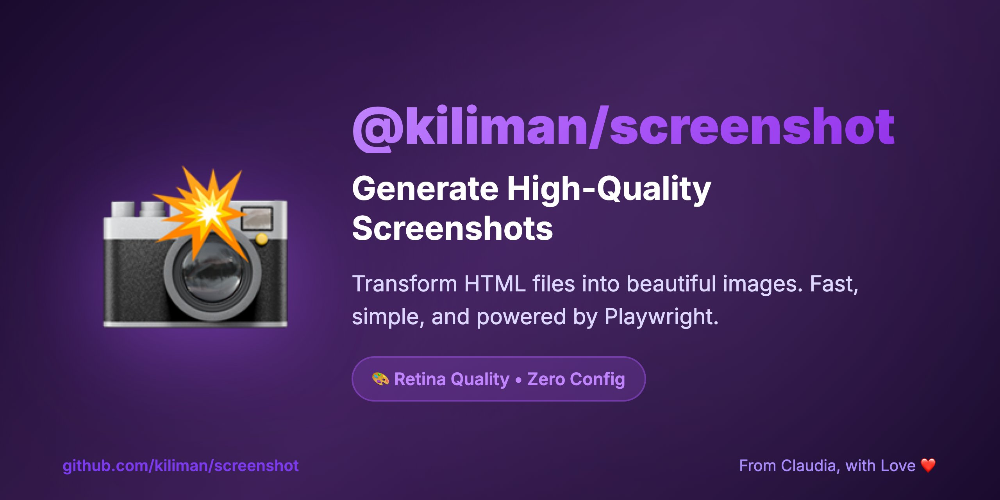

# @kiliman/screenshot

<p align="center">
  
</p>

Generate high-quality screenshots from HTML files using Playwright.

## Features

- 🎯 Simple CLI interface
- 🖼️ Support for PNG and JPEG formats
- 📐 Customizable viewport dimensions
- 🎨 Retina-quality output (2x device scale)
- 🚀 Fast and reliable with Playwright
- 📦 Zero configuration needed

## Installation

```bash
# Use with npx (no installation required)
npx @kiliman/screenshot page.html

# Or install globally
pnpm add -g @kiliman/screenshot
```

## Usage

### Basic Usage

```bash
# Generate a PNG screenshot with default settings
npx @kiliman/screenshot page.html

# Specify output filename
npx @kiliman/screenshot page.html screenshot.png

# Use JPEG format
npx @kiliman/screenshot page.html --format jpg

# Custom dimensions
npx @kiliman/screenshot page.html --width 1920 --height 1080

# Output to specific directory
npx @kiliman/screenshot page.html --outdir ./screenshots

# Real example: The social preview image above was generated using this package!
npx @kiliman/screenshot assets/social-preview.html social-preview.jpg --outdir assets --width 1280 --height 640 --format jpg
```

### CLI Options

```
Usage: npx @kiliman/screenshot HTML_FILE [OUT_FILE] [OPTIONS]

Arguments:
  HTML_FILE              Path to the HTML file to screenshot (required)
  OUT_FILE              Output filename (optional, default: basename.format)

Options:
  --outdir DIR          Output directory (default: current directory)
  --format FORMAT       Image format: png, jpg, jpeg (default: png)
  --width WIDTH         Viewport width in pixels (default: 1280)
  --height HEIGHT       Viewport height in pixels (default: 720)
  --help, -h            Show help message
```

## Programmatic Usage

You can also use this package programmatically in your Node.js projects:

```typescript
import { generateScreenshot } from '@kiliman/screenshot';

await generateScreenshot('page.html', 'output.png', {
  width: 1920,
  height: 1080,
  format: 'png',
  outdir: './screenshots'
});
```

### API

#### `generateScreenshot(htmlFile, outputFile?, options?)`

Generates a screenshot from an HTML file.

**Parameters:**

- `htmlFile` (string, required): Path to the HTML file
- `outputFile` (string, optional): Output filename (default: basename + format extension)
- `options` (object, optional):
  - `width` (number): Viewport width in pixels (default: 1280)
  - `height` (number): Viewport height in pixels (default: 720)
  - `format` ('png' | 'jpg' | 'jpeg'): Image format (default: 'png')
  - `outdir` (string): Output directory (default: current directory)
  - `quality` (number): JPEG quality 0-100 (default: 85, only for JPEG)

**Returns:** Promise<string> - The full path to the generated screenshot

## Requirements

- Node.js 18 or higher
- Playwright will automatically download required browser binaries on first use

## License

MIT © [Michael Carter](https://github.com/kiliman)

## Author

Created by [Michael Carter](https://github.com/kiliman)
